#+TITLE: NextLearn — Project Documentation

#+LATEX_COMPILER: xelatex
#+LATEX_CLASS_OPTIONS: [14pt]
#+LATEX_HEADER: \usepackage{graphicx}
#+LATEX_HEADER: \usepackage{hyperref}
#+LATEX_HEADER: \usepackage{listings}
#+LATEX_HEADER: \usepackage[margin=0.7in]{geometry}
#+LATEX_HEADER: \usepackage{booktabs}
#+LATEX_HEADER: \usepackage{fontspec}
#+LATEX_HEADER: \setmainfont{Hack}
#+LATEX_HEADER: \setmonofont{Hack}
#+OPTIONS: toc:2 num:4 H:5 date:nil

\newpage
* Cover Page
:PROPERTIES:
:CUSTOM_ID: cover-page
:END:

#+ATTR_LATEX: :width 300
#+ATTR_ORG: :width 300
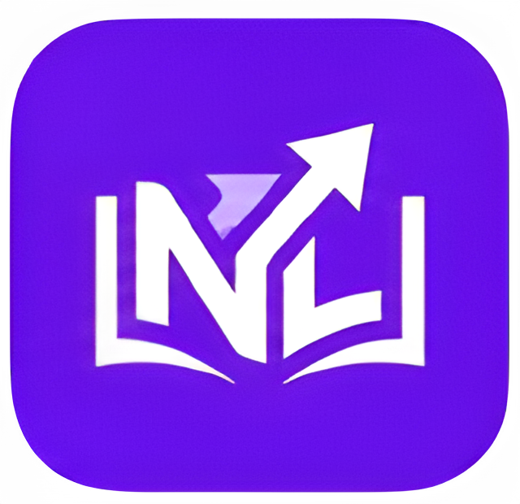

\begin{center}
{\Huge \textbf{NextLearn}} \\[1em]
{\Large Distraction-Free Digital Study Environment} \\[2em]
{\large Project Documentation} \\[3em]

\textbf{Zagazig University} \\
Faculty of Computers and Informatics \\[1em]
IT department \\[1em]

\Large \textbf{By: Hassan Ahmad Darwish (NSB)} \\[1em]

\Large \textbf{Supervised By:} \\[1em]
\Large \textbf{Eng. Ahmad Atif} \\[1em]
\Large \textbf{Dr. Ehab Rushdy} \\[1em]

\textbf{Version:} 1.0.0
\end{center}

\newpage

* Introduction
:PROPERTIES:
:CUSTOM_ID: introduction
:END:

** Problem Statement
:PROPERTIES:
:CUSTOM_ID: problem-statement
:END:

- Modern learners face a tsunami of study tools. The typical student juggles multiple applications
  - a note-taking app for course content
  - a flashcard app for memorization
  - a quiz platform for self-assessment
  - and a calendar or timer for study sessions.
Each tool has its own data format, its own synchronization mechanism, and
critically **its own set of distractions**.

- The core problem is twofold:
  - **Context Switching Cost** — Moving between tools breaks the mental
      state of deep study. Every application boundary is an opportunity
      for distraction: notifications, advertisements, social features, and
      unrelated content compete for the learner's attention.

  - **Vendor Lock-in and Data Portability** — Most learning platforms
      store content in proprietary databases. Exporting to a different
      tool is difficult or impossible. The learner's intellectual work is
      trapped inside a single ecosystem.

  - **Customization Constraints** — Mainstream study apps offer limited
      keyboard customization, few theming options, and no scripting
      capabilities. Users who prefer keyboard-centric workflows (Vim,
      Emacs) or require accessibility accommodations are underserved.

  - **AI Integration Fragmentation** — When AI-powered features exist,
      they are typically tied to subscription tiers, have opaque
      algorithms, and cannot be used with locally-stored content.

\newpage

** Solution & Significance of Work
:PROPERTIES:
:CUSTOM_ID: solution-significance
:END:

NextLearn addresses these problems by providing a single, distraction-free
desktop application that integrates:

- **File-based content management** — Decks are plain-text =.md=, =.org=,
  or =.txt= files stored in a local vault.
  - No proprietary database for content.
  - Your study material is portable
  - version-controllable (git),
  - and editable in any text editor.

- **Keyboard-centric navigation** — Three built-in keybinding profiles
  (Vim, Emacs, VS Code) with multi-key chords, a command palette, and
  a customizable keybinding system. Every action is accessible
  **without touching the mouse**.

- **Offline-first architecture** — All core features (deck reading,
  search, study, heatmap tracking, focus timer), which is almost 80%
  of the app, work without an internet connection. Only optional AI
   features (tag inference, flashcard generation, MCQ generation)
   require the network.

- **Integrated AI with local-first workflow** — Google Gemini API is
  used for optional AI assistance: tag suggestion, flashcard creation,
  and MCQ quiz generation. The AI writes to local files that the user
  can review, edit, and control.

- **Built-in assessment tools** — MCQ quizzes with interactive WebView
  rendering, Anki-compatible flashcard export, and a Pomodoro focus
  timer — all within the same application window.

The significance of this work lies in demonstrating that a single
developer can build a professional-grade, cross-platform study
environment using free and open-source technologies (.NET, Avalonia UI,
SQLite), integrate AI services without compromising local control, and
create a keyboard-first user experience that rivals mainstream
applications. **IT IS POSSIBLE.**

\newpage
** Existing Solutions — Limitations vs NextLearn Advantages
:PROPERTIES:
:CUSTOM_ID: existing-solutions
:END:

*** anki
| Aspect                | Anki                                |
|-----------------------+-------------------------------------|
| Content Format        | in action it uses proprietary .apkg |
| Keyboard Navigation   | Basic shortcuts                     |
| AI Integration        | No native AI                        |
| Assessment            | flashcards only                     |
| Offline Capability    | Full [+1]                           |
| Customizability       | Add-ons only                        |
| Cross-Platform        | Windows/macOS/Linux/Android [+1]    |
| Study Streak Tracking | Basic                               |
| File Portability      | Requires export                     |
| Cost                  | Free [+1]                           |
| Focus / Timer         | No                                  |

*** obsidian.md
| Aspect                | Obsidian                        |
|-----------------------+---------------------------------|
| Content Format        | Markdown files                  |
| Keyboard Navigation   | Limited                         |
| AI Integration        | Community plugins only          |
| Assessment            | No native quizzes               |
| Offline Capability    | Full [+1]                       |
| Customizability       | Plugin system                   |
| Cross-Platform        | Windows/macOS/Linux/mobile [+1] |
| Study Streak Tracking | Community plugin                |
| File Portability      | Native (plain markdown) [+1]    |
| Cost                  | Free (sync paid) [+1]           |
| Focus / Timer         | Community plugin                |

\newpage
*** superMemo
| Aspect                | Roam Research  | SuperMemo             |
|-----------------------+----------------+-----------------------|
| Content Format        | Proprietary    | Proprietary .sm       |
| Keyboard Navigation   | Moderate       | Minimal               |
| AI Integration        | Limited AI     | No                    |
| Assessment            | No             | SRS + some tests [+1] |
| Offline Capability    | Limited        | Full [+1]             |
| Customizability       | Limited        | Minimal               |
| Cross-Platform        | Web-based [+1] | Windows (limited)     |
| Study Streak Tracking | No             | Basic                 |
| File Portability      | Export only    | Export only           |
| Cost                  | Subscription   | Paid                  |
| Focus / Timer         | No             | No                    |

*** nextlearn
| Aspect                | NextLearn                           |
|-----------------------+-------------------------------------|
| Content Format        | .md / .org / .txt files [+1]        |
| Keyboard Navigation   | Vim/Emacs/VS Code profiles [+1]     |
| AI Integration        | Built-in Gemini (tags, MCQs) [+1]   |
| Assessment            | Flashcards + MCQ + Focus Timer [+1] |
| Offline Capability    | Full (AI optional)  [+1]            |
| Customizability       | YAML config + keybinding YAML [+1]  |
| Cross-Platform        | Linux/macOS (Windows planned)       |
| Study Streak Tracking | Built-in heatmap + daily log [+1]   |
| File Portability      | Native (plain text) [+1]            |
| Cost                  | Free (open source) [+1]             |
| Focus / Timer         | Built-in Pomodoro + todos [+1]      |

- Key advantages of NextLearn over existing solutions:
  1) Single-application gear for reading, flashcards, quizzes, timer, and streak tracking — eliminating context switching.
  2) Plain-text file format as the source of truth — not a database dump.
  3) Keyboard profiles that match the user's existing muscle memory(vim, emacs, vscode, custom).
  4) Deterministic deck identity via SHA256 file path hashing — progress survives the file renames and OS reinstallation.
  5) AI features that write to the user's local file system, not a locked cloud service.

\newpage
** Background
:PROPERTIES:
:CUSTOM_ID: background
:END:

*** Linux Philosophy and Customizability
:PROPERTIES:
:CUSTOM_ID: linux-philosophy
:END:

NextLearn was developed on primarily on ArchLinux. The design
philosophy draws heavily from the Unix tradition:

- **Do one thing well** — The app is a study tool, not a notes app,
  not a project manager, not a social network.
- **Plain text as universal interface** — Deck files are plain text.
  Users can edit them with any tool, version them with git, and
  transform them with shell scripts.
- **Composability** — The app is designed to fit into a Linux workflow.
  File manager integration, CLI-paired deck creation, and
  git-backed version history are first-class concerns.
- **Transparency** — All data lives in standard locations:

  (=~/.config/nextlearn/=, =~/nextlearn/decks/=). No hidden databases
  or opaque binary formats.

*** Vim, Emacs and VScode Influence
:PROPERTIES:
:CUSTOM_ID: vim-emacs-influence
:END:

The keyboard shortcut system is directly inspired by the two great
traditions of modal editing:

- **Vim profile** — Single-key navigation (j/k for scroll, n/p for
  pages), modal context awareness, and the =g= leader key for chords.
  The command palette (activated by =:=) mirrors Vim's command-line
  mode.

- **Emacs profile** — Chords with modifier keys (=C-n=, =C-p=), prefix
  key sequences (=C-x=, =C-c=), and the =M-x= command palette. The
  chord display indicator shows pending key sequences with a 500ms
  timeout, also got inspiration for Emacs's =C-g= cancel mechanism.

- **VS Code profile** — Familiar shortcuts for users coming from the
  most popular modern editor (=Ctrl+Shift+P= for command palette,
  =Ctrl+B= for sidebar, =Ctrl+W= for close).

Supporting these three profiles means users can be productive within
seconds of first launch — no need to learn a new keybinding system from
scratch.

\newpage
*** .NET Ecosystem and Avalonia UI
:PROPERTIES:
:CUSTOM_ID: dotnet-avalonia
:END:

The technical foundation is .NET 10.0 with Avalonia UI, chosen for:

- Cross-platform desktop rendering (Linux, macOS, Windows) from a single
  codebase.
- XAML-based declarative UI with MVVM architecture via
  CommunityToolkit.Mvvm (source-generated observable properties and
  relay commands).
- Direct hardware acceleration via Skia rendering backend.
- NativeWebView control for HTML content rendering, enabling rich
  text display with KaTeX math and highlight.js syntax highlighting.

Notice: The reason why the app is not cross-platform currently is not because of AvaloniaUI. It's because of Windows using a different WebView that the one used on Linux.

** Methodology
:PROPERTIES:
:CUSTOM_ID: methodology
:END:

*** Chosen Methodology and choices
:PROPERTIES:
:CUSTOM_ID: chosen-methodology-kanban
:END:

**** Kanban planning
NextLearn was developed using a Kanban-style approach, the obsidian Kanban plugin

https://github.com/obsidian-community/obsidian-kanban

, also documented in
=plan-todos.org= which is for plans & todos (1351 lines of feature planning). The choice was driven
by:

- Single-developer project — no need for sprint ceremonies or
  team coordination.
- Evolving scope — features were added based on user (self) feedback and
  practical need, not a fixed requirements document.
- Continuous delivery — every feature went through the same pipeline:

  plan → implement → test → feedback → document → commit.

The Kanban board is informal but effective:
#+begin_src text
  TODO (plan-todos.org) → In Progress (active work) → Done (committed)
#+end_src

Each feature entry in =plan-todos.org= includes:
- Detailed specification with rationale
- File-by-file change list
- Edge case table
- Test impact assessment
- Progress UI step table (where applicable)

**** Choices
- I chose to use the WebView because it allowing for  a customization layer on rendering (Plain-text, markdown, org-mode files)
- I chose to make the desktop version first because:
  1. I needed that app to work mostly offline.
  2. It's more likely for students to serious study session on their laptops or PCs, not their mobiles.

\newpage
*** Other choices
:PROPERTIES:
:CUSTOM_ID: other-choices
:END:

| Choise                     | Rejected Because                                          |
|----------------------------+-----------------------------------------------------------|
| Avalonia.Controls.Markdown | Tightly coupled to .md files, no extensibility            |
| Markdig                    | newly heard of, no idea if it's better or not             |
| Markdown.Avalonia          | bloated, full editor, adds more lag, no custom font sizes |

** Project Objectives
:PROPERTIES:
:CUSTOM_ID: project-objectives
:END:

1. **Study Environment** — Provide a distraction-free, keyboard-centric
   application for reading markdown, org-mode, plain-text decks as paginated
   slides.

2. **File-First Architecture** — Use plain text files as the source of
   truth for all study content. No proprietary content format.

3. **Cross-Platform Desktop** — Target Linux (primary), macOS, and
   Windows using a single .NET/Avalonia codebase.

4. **Integrated Learning Tools** — Include flashcard generation, MCQ
   quizzes, and a Pomodoro timer within the same application.

5. **Optional AI Assistance** — Integrate AI services (Google Gemini)
   for tag suggestion, flashcard creation, and quiz generation without
   requiring internet connectivity for core features.
   FYI, you can just go to https://github.com/megamind1230/nextlearn
   to copy the AI prompts.

6. **Progress Tracking** — Track study streaks, daily minutes, and
   page-level progress with a persistent heatmap visualization.

7. **Customizability** — Provide configurable keybinding profiles,
   dark/light theme switching, and font/text-size adjustment without
   requiring plugin installation.

8. **Keyboard-First Design** — Support three major keybinding profiles
   (Vim, Emacs, VS Code) with multi-key chords and a command palette
   for full mouse-free operation.

\newpage

* Planning & Requirements
:PROPERTIES:
:CUSTOM_ID: planning-requirements
:END:

** Project State & Scope
:PROPERTIES:
:CUSTOM_ID: project-state
:END:

NextLearn is currently in active development with the following scope
constraints:

- **Platform Focus**: Linux (primary). WebView rendering uses
  =libwpewebkit-2.0= and related WPE dependencies available on Linux.
  macOS builds pass CI but are less tested. Windows is not currently
  supported (requires WebView2; I lack a Windows machine for
  consistent testing).

- **Single-User Mode**: The app creates a local "Guest" user on first
  launch. No multi-user or cloud sync features.

- **Optional AI**: All Google Gemini API features (tag inference,
  flashcard generation, MCQ generation) are optional. The app functions
  fully without them.

- **Offline-First**: Core features require zero network connectivity.
  Only AI features depend on internet access.

** Development Tools & Environment
:PROPERTIES:
:CUSTOM_ID: dev-tools
:END:

The project was developed using a deliberately minimal toolchain.
Experience with the tools shaped both the development process and the
design philosophy:

| Tool                | Purpose                                       |
|---------------------+-----------------------------------------------|
| VS Code             | Primary IDE for C# and XAML development       |
| Vim                 | Fast edits, configuration file changes, shell |
| Emacs (org-mode)    | Documentation, planning and some code edits   |
| Git (CLI)           | Version control                               |
| JetBrains Rider     | Tried as alternative IDE                      |
| Avalonia Hot Reload | XAML live preview                             |

| Tool                | Notes                                                                 |
|---------------------+-----------------------------------------------------------------------|
| VS Code             | With C# Dev Kit, Avalonia, and Markdown plugins                       |
| Vim                 | Used for quick file modifications                                     |
| Emacs (org-mode)    | All .org files (README, changelog, bugs, plan-todos) created in Emacs |
| Git (CLI)           | Command-line git, no GUI wrapper                                      |
| JetBrains Rider     | Abandoned: too heavy for the low-end development machine              |
| Avalonia Hot Reload | Discovered late in development cycle; never used in practice          |

#+begin_quote
    The "Avalonia Hot Reload" discovery is notable: the author was unaware
    that Avalonia supported XAML live reloading until approximately 80% of
    the core UI was complete. By that point, the edit-compile-run cycle was
    already embedded in the workflow, and adopting hot reload mid-project
    offered marginal benefit. This is documented as a lesson for future
    projects.
#+end_quote

\newpage
** Technology Stack
:PROPERTIES:
:CUSTOM_ID: tech-stack
:END:

*** versions @10jul2026
| Technology                   | Version                  |
|------------------------------+--------------------------|
| .NET                         | 10.0                     |
| Avalonia UI                  | 11.3.12                  |
| CommunityToolkit.Mvvm        | 8.2.1                    |
| Entity Framework Core        | 8.0.0                    |
| SQLite                       | (EF Core) 3.53.3         |
| Serilog                      | 4.3.1                    |
| NativeWebView                | 0.1.0-alpha.3            |
| NativeWebView.Platform.Linux | 0.1.0-alpha.3            |
| YamlDotNet                   | 18.0.0                   |
| highlight.js                 | 11.11.1 (edited, custom) |
| KaTeX                        | (bundled)                |
| StyleCop.Analyzers           | 1.2.0-beta.556           |
| Google Gemini API            | REST                     |
| xUnit                        | (latest)                 |
| FluentAssertions             | (latest)                 |
| NSubstitute                  | (latest)                 |

*** why used
| Technology                   | Purpose                                                         |
|------------------------------+-----------------------------------------------------------------|
| .NET                         | Runtime framework                                               |
| Avalonia UI                  | Cross-platform desktop UI framework                             |
| CommunityToolkit.Mvvm        | Source-generated MVVM pattern                                   |
| Entity Framework Core        | ORM for SQLite                                                  |
| SQLite                       | fast, lightweight, embedded local database                      |
| Serilog                      | Structured logging (file + console)                             |
| NativeWebView                | System WebView HTML rendering                                   |
| NativeWebView.Platform.Linux | Linux WebView backend (WPE WebKit)                              |
| YamlDotNet                   | YAML serialization (settings, keybindings, focus timer data)    |
| highlight.js                 | syntax highlighting (52 langs, bundled as custom-highlight.js)  |
| KaTeX                        | LaTeX math rendering (katex.min.js, katex.min.css, auto-render) |
| StyleCop.Analyzers           | C# code style enforcement                                       |
| Google Gemini API            | AI tag inference, flashcard generation, MCQ generation          |
| xUnit                        | Unit testing framework                                          |
| FluentAssertions             | Readable test assertions                                        |
| NSubstitute                  | Mocking framework                                               |
** System Dependencies (Linux runtime)
:PROPERTIES:
:CUSTOM_ID: system-dependencies
:END:

- libwpewebkit-2.0 (WebView engine)
- libwpe-1.0
- libWPEBackend-fdo-1.0
- Wayland auto-detection: =XDG_SESSION_TYPE=wayland= → X11 fallback
  via =UseSkia().UseX11()=

\newpage

** Functional Requirements
:PROPERTIES:
:CUSTOM_ID: functional-requirements
:END:

*** Core Deck Management
:PROPERTIES:
:CUSTOM_ID: core-deck-management
:END:

- FR-01: Read =.md=, =.org=, and =.txt= files from a configurable vault
  directory (default =~/nextlearn/decks/=)
- FR-02: Parse YAML frontmatter for title, description, and tags in
  =.md= and =.org= files
- FR-03: Split decks into paginated slides based on heading hierarchy
  (=#= / =##= for sections and pages)
- FR-04: Auto-refresh deck list when files change via FileSystemWatcher
- FR-05: Search decks by title, description, filename, and tags (with
  prefix operators =file:=, =title:=, =desc:=, =tags:=)
- FR-06: Regex toggle for search
- FR-07: Pin/archive/unpin/unarchive decks via file rename convention
  (=+.md= for pinned, =.md~= for archived)
- FR-08: Deterministic deck identity via SHA256 file path hash
- FR-09: Recursive vault scanning with subdirectory support
- FR-10: Open decks folder in system file manager

*** Study & Navigation
:PROPERTIES:
:CUSTOM_ID: study-and-nav
:END:

- FR-11: Page-by-page learning with previous/next navigation
- FR-12: Section breadcrumb showing current position in deck hierarchy
- FR-13: Rendered markdown and org-mode content in WebView
- FR-14: Code syntax highlighting via highlight.js (52 languages)
- FR-15: Markdown/Org table rendering
- FR-16: Image rendering (inline + floating image overlay with zoom,
  navigation, invert colors)
- FR-17: Clickable http/https links and wiki-style deck links
- FR-18: Quote block rendering (= > = syntax)
- FR-19: Org general block rendering (=#+BEGIN_*= / =#+END_*=)
- FR-20: Falcon Eye table of contents (auto-generated TOC page per deck)
- FR-21: Todo checkbox rendering ([ ], [x], [-], [~])
- FR-22: Copy button on code and quote blocks
- FR-23: LaTeX math rendering via KaTeX (inline =$..$=, display
  =$$..$$=)
- FR-24: Go-to-page dialog (Ctrl+G)
- FR-25: Text zoom in/out/reset (Ctrl+Shift++/-/0)

\newpage
*** Keyboard System
:PROPERTIES:
:CUSTOM_ID: keyboard-system
:END:

- FR-26: Three built-in keybinding profiles (Vim, Emacs, VS Code)
- FR-27: Customizable keybinding via YAML config file
- FR-28: Multi-key chord support with 500ms timeout and visual
  indicator
- FR-29: Command palette with fuzzy search (activated by =:= or =M-x=)
- FR-30: Shortcuts handbook (auto-generated from current profile)
- FR-31: 67 keyboard actions (ISTG I didn't mean to make this up) across multiple contexts (Learning,
  Home, ImageOverlay, McqQuiz)
- FR-32: Esc-based overlay closing priority chain

*** AI Features (Google Gemini)
:PROPERTIES:
:CUSTOM_ID: ai-features
:END:

- FR-33: AI tag inference — suggest 2--15 tags per deck, diff preview,
  apply to frontmatter (supports 7 tag format styles)
- FR-34: Anki flashcard generation — Basic (TSV) and Cloze ({{c1::}})
  modes, separate prompts, save to =.basic.txt= / =.cloze.txt= files
- FR-35: MCQ quiz generation — AI-generated questions, interactive
  quiz in dedicated WebView (4 option list, timer, scoring)
- FR-36: Model auto-discovery and fallback chain (gemini-2.5-flash →
  gemini-2.0-flash → etc.)
- FR-37: Exponential retry with backoff (1s, 5s, 10s, 20s, 40s, 80s)
- FR-38: Token estimation with 700K truncation limit

*** Progress & Analytics
:PROPERTIES:
:CUSTOM_ID: progress-analytics
:END:

- FR-39: Per-user progress tracking (current page, completed decks)
- FR-40: Daily activity tracking (pages viewed, minutes learned)
- FR-41: Study streak heatmap (snake layout, 6-level orange, green border for
  today)
- FR-42: Stable progress across restarts (SQLite persistence)

\newpage
*** Focus Timer
:PROPERTIES:
:CUSTOM_ID: focus-timer
:END:

- FR-43: Pomodoro-style work/break countdown timer
- FR-44: Configurable work/break durations in settings
- FR-45: Persistent todo list (CRUD) with YAML persistence
- FR-46: Session history log
- FR-47: Sound notification at session end

*** Settings & Configuration
:PROPERTIES:
:CUSTOM_ID: settings-configuration
:END:

- FR-48: Theme switching (Dark/Light) with live preview
- FR-49: Configurable decks, MCQs, and flashcards paths
- FR-50: Gemini API key configuration with status indicator
- FR-51: Configurable font selection
- FR-52: Settings persistence in =settings.yaml=
- FR-53: Save/Reset settings

** Non-Functional Requirements
:PROPERTIES:
:CUSTOM_ID: non-functional-requirements
:END:

| Requirement                | Description                                                 |
|----------------------------+-------------------------------------------------------------|
| Offline Operation          | Core features must work without internet                    |
| Startup Time               | App must launch within 10 seconds                           |
| File Change Responsiveness | Deck list must refresh within 500ms of file change          |
| Memory Footprint           | Must run on 4GB RAM systems (low-end machine target)        |
| Single-User Architecture   | No multi-user sync or authentication required               |
| Data Durability            | No data loss on crash — SQLite WAL mode, YAML atomic writes |
| no Keyboard-Only Operation | All features accessible without mouse                       |
| Open Data Format           | All user data in plain text (.md, .org, .yaml, .txt)        |
| Cross-Platform Compatible  | Builds on Linux (x64), macOS (arm64), Windows (x64)         |
| No Vendor Lock-In          | User can stop using the app and keep all data intact        |
| CI/CD Integration          | Automated build + test on every push via GitHub Actions     |
| Single-File Distribution   | Published as self-contained executable                      |

\newpage

* System Design
:PROPERTIES:
:CUSTOM_ID: system-design
:END:

** System Architecture
:PROPERTIES:
:CUSTOM_ID: system-architecture
:END:

NextLearn follows a layered MVVM (Model-View-ViewModel) architecture
with a single-window UI pattern.

  #+ATTR_LATEX: :width 550
  #+ATTR_ORG: :width 550
  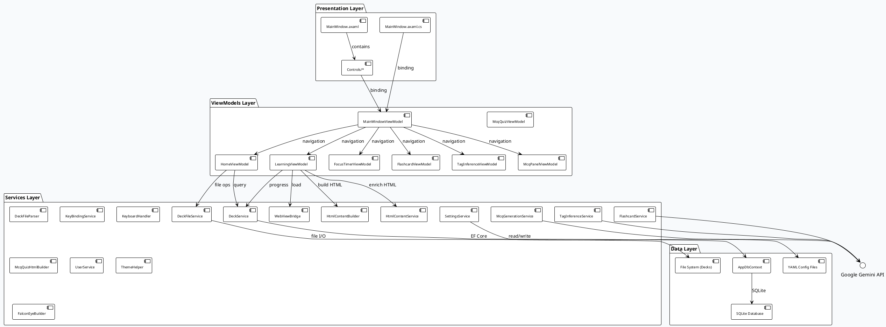

*** Single-Window UI Pattern
:PROPERTIES:
:CUSTOM_ID: single-window-ui
:END:

Unlike most desktop applications that use multiple windows or a
navigation framework, NextLearn uses a single =MainWindow.axaml= with
approximately 15 boolean visibility flags to show/hide panels:

#+begin_src text
  IsLearning        → learning view (WebView content + pagination)
  IsSettingsOpen    → settings overlay
  IsSidebarOpen     → sidebar panel
  IsTagInferenceOpen → tag inference panel
  IsFlashcardOpen   → flashcard generation panel
  IsMcqOpen         → MCQ quiz panel (3 tabs)
  IsTimerOpen       → focus timer panel
  IsPinnedViewOpen   → pinned decks overlay
  IsArchivedViewOpen → archived decks overlay
  IsHeatmapOpen     → streak heatmap overlay
  IsCommandPaletteOpen → command palette
  IsShortcutsHandbookOpen → shortcuts handbook
  IsGoToPageOpen    → go-to-page dialog
  IsImageOverlayOpen → image overlay
  IsDeckLinkPromptOpen → deck link navigation prompt
#+end_src

This approach eliminates navigation stacks and keeps the memory
footprint minimal. Only one panel is visible at a time (except sidebar,
which overlays).

\newpage

** UML Diagrams
:PROPERTIES:
:CUSTOM_ID: uml-diagrams
:END:

*** Use Case Diagram
:PROPERTIES:
:CUSTOM_ID: use-case-diagram
:END:

  #+ATTR_LATEX: :width 550
  #+ATTR_ORG: :width 550
  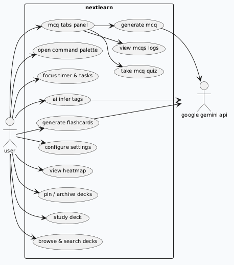

\newpage
*** Class Diagram — Core Models
:PROPERTIES:
:CUSTOM_ID: class-diagram-core-models
:END:

  #+ATTR_LATEX: :width
  #+ATTR_ORG: :width
  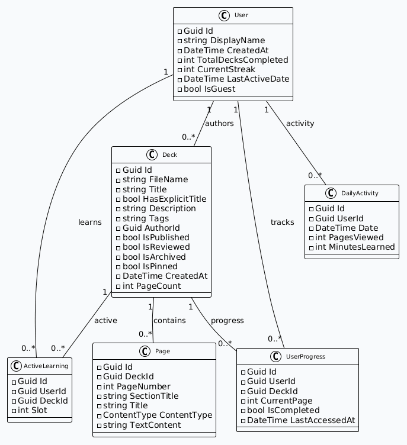

*** Class Diagram — Core Services
:PROPERTIES:
:CUSTOM_ID: class-diagram-core-services
:END:

\newpage
  #+ATTR_LATEX: :height 700
  #+ATTR_ORG: :height 700
  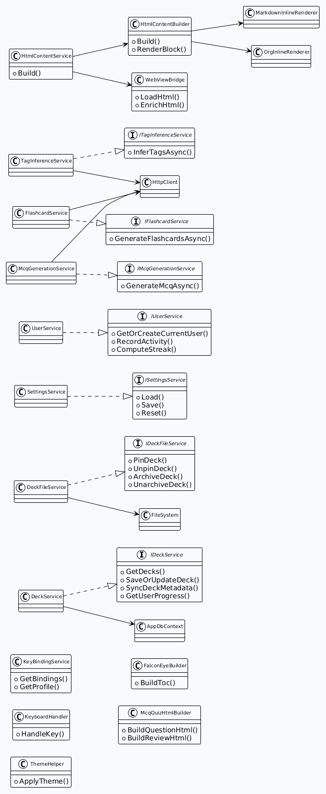

*** Activity Diagram — Study Flow
:PROPERTIES:
:CUSTOM_ID: activity-diagram-study-flow
:END:

  #+ATTR_LATEX: :width
  #+ATTR_ORG: :width
  #+ATTR_LATEX: :height 700
  #+ATTR_ORG: :height 700
  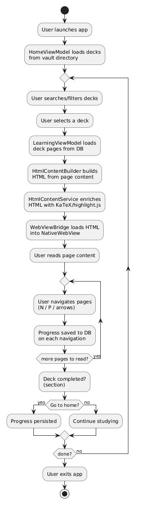

*** Activity Diagram — MCQ Quiz Flow
:PROPERTIES:
:CUSTOM_ID: activity-diagram-mcq-flow
:END:

  #+ATTR_LATEX: :width
  #+ATTR_ORG: :width
  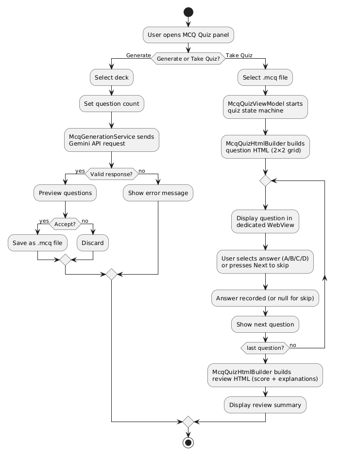

*** Sequence Diagram — AI Tag Inference
:PROPERTIES:
:CUSTOM_ID: sequence-diagram-tag-inference
:END:

  #+ATTR_LATEX: :width 550
  #+ATTR_ORG: :width 550
  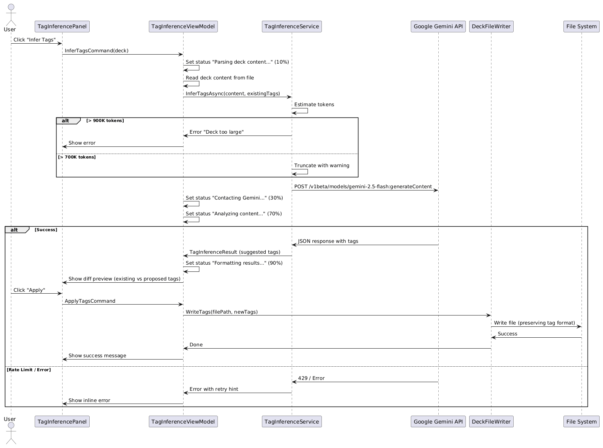

*** ER Diagram — Database Schema
:PROPERTIES:
:CUSTOM_ID: er-diagram
:END:

  #+ATTR_LATEX: :width
  #+ATTR_ORG: :width
  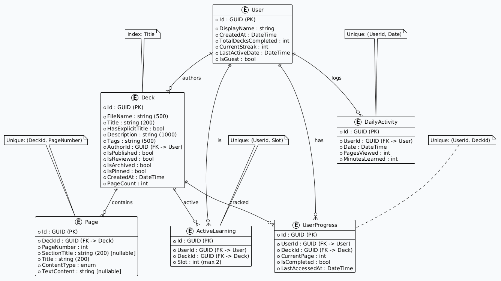

** Database Design
:PROPERTIES:
:CUSTOM_ID: database-design
:END:

The SQLite database is stored at =~/.config/nextlearn/nextlearn.db= and
contains 6 tables managed by Entity Framework Core 8.0.0. The database
stores only metadata and progress — deck content lives in the file system.

*** Table: Users
:PROPERTIES:
:CUSTOM_ID: table-users
:END:

#+begin_src text
  Column              Type     Constraints Notes
  ──────────────────────────────────────────────────────
  Id                  GUID     PK          Auto-generated
  DisplayName         string   NOT NULL    Default "Guest"
  CreatedAt           DateTime NOT NULL
  TotalDecksCompleted int      NOT NULL    Counter
  CurrentStreak       int      NOT NULL    Computed from daily activity
  LastActiveDate      DateTime NOT NULL
  IsGuest             bool     NOT NULL    Always true (single-user)
#+end_src

\newpage

*** Table: Decks
:PROPERTIES:
:CUSTOM_ID: table-decks
:END:

#+begin_src text
  Column           Type        Constraints         Notes
  ──────────────────────────────────────────────────────────────
  Id               GUID        PK                  Deterministic (SHA256 of path)
  FileName         string(500) NOT NULL            Relative vault path
  Title            string(200) NOT NULL            Indexed
  HasExplicitTitle bool        NOT NULL
  Description      string(1000)NOT NULL
  Tags             string(500) NOT NULL            Comma-separated
  AuthorId         GUID        FK → Users.Id
  IsPublished      bool        NOT NULL
  IsReviewed       bool        NOT NULL
  IsArchived       bool        NOT NULL            '~' suffix convention
  IsPinned         bool        NOT NULL            '+' prefix convention
  CreatedAt        DateTime    NOT NULL
  PageCount        int         NOT NULL
#+end_src

*** Table: Pages
:PROPERTIES:
:CUSTOM_ID: table-pages
:END:

#+begin_src text
  Column              Type        Constraints     Notes
  ───────────────────────────────────────────────────────────
  Id                  GUID        PK
  DeckId              GUID        FK → Decks.Id
  PageNumber          int         NOT NULL        1-based
  SectionTitle        string(200) NULLABLE        From # heading
  Title               string(200) NOT NULL        From ## or first line
  ContentType         enum        NOT NULL        Text (only value)
  TextContent         string?     NULLABLE        Raw markdown/org

  UNIQUE INDEX: (DeckId, PageNumber)
#+end_src

*** Table: UserProgress
:PROPERTIES:
:CUSTOM_ID: table-userprogress
:END:

#+begin_src text
  Column              Type        Constraints    Notes
  ──────────────────────────────────────────────────────────
  Id                  GUID        PK
  UserId              GUID        FK → Users.Id
  DeckId              GUID        FK → Decks.Id
  CurrentPage         int         NOT NULL       Default 1
  IsCompleted         bool        NOT NULL
  LastAccessedAt      DateTime    NOT NULL

  UNIQUE INDEX: (UserId, DeckId)
#+end_src

\newpage
*** Table: ActiveLearning
:PROPERTIES:
:CUSTOM_ID: table-activelearning
:END:

#+begin_src text
  Column              Type        Constraints     Notes
  ───────────────────────────────────────────────────────────
  Id                  GUID        PK
  UserId              GUID        FK → Users.Id
  DeckId              GUID        FK → Decks.Id
  Slot                int         NOT NULL        Up to 2 concurrent

  UNIQUE INDEX: (UserId, Slot)
#+end_src

*** Table: DailyActivities
:PROPERTIES:
:CUSTOM_ID: table-dailyactivities
:END:

#+begin_src text
  Column              Type        Constraints     Notes
  ───────────────────────────────────────────────────────────
  Id                  GUID        PK
  UserId              GUID        FK → Users.Id
  Date                DateTime    NOT NULL        Wall-clock date
  PagesViewed         int         NOT NULL
  MinutesLearned      int         NOT NULL

  UNIQUE INDEX: (UserId, Date)
#+end_src

** User Flow Diagrams
:PROPERTIES:
:CUSTOM_ID: user-flow-diagrams
:END:

*** End-to-End Study Flow
:PROPERTIES:
:CUSTOM_ID: e2e-study-flow
:END:

\newpage
  #+ATTR_LATEX: :width
  #+ATTR_ORG: :width
  #+ATTR_LATEX: :height 700
  #+ATTR_ORG: :height 700
  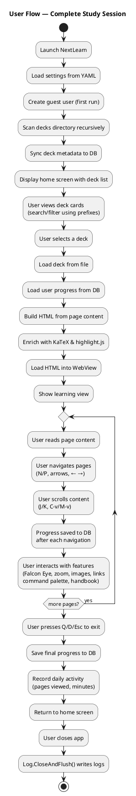

*** AI Feature Usage Flow
:PROPERTIES:
:CUSTOM_ID: ai-feature-flow
:END:

  #+ATTR_LATEX: :width
  #+ATTR_ORG: :width
  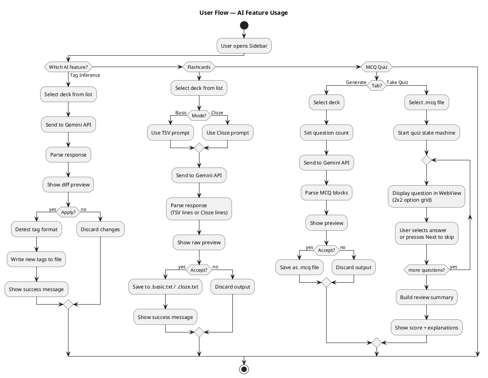

** Core Services
:PROPERTIES:
:CUSTOM_ID: core-services
:END:

NextLearn is built around 21 key services, each with a specific
responsibility. Below is the complete inventory with roles and file
locations:
*** services files
| Service                 | File                                        |
|-------------------------+---------------------------------------------|
| ThemeHelper             | Services/ThemeHelper.cs                     |
| DeckFileParser          | Services/DeckFileParser.cs                  |
| DeckFileIdentity        | Services/DeckFileIdentity.cs                |
| DeckService             | Services/DeckService.cs                     |
| DeckFileService         | Services/DeckFileService.cs                 |
| UserService             | Services/UserService.cs                     |
| SettingsService         | Services/SettingsService.cs                 |
| HtmlContentBuilder      | Services/HtmlContentBuilder.cs (1049 lines) |
| HtmlContentService      | Services/HtmlContentService.cs              |
| FalconEyeBuilder        | Services/FalconEyeBuilder.cs                |
| MarkdownInlineRenderer  | Services/MarkdownInlineRenderer.cs          |
| OrgInlineRenderer       | Services/OrgInlineRenderer.cs               |
| TagInferenceService     | Services/TagInferenceService.cs             |
| TagInferenceResult      | Services/TagInferenceResult.cs              |
| DeckFileWriter          | Services/DeckFileWriter.cs                  |
| FlashcardService        | Services/FlashcardService.cs                |
| FlashcardGenerationMode | Services/FlashcardGenerationMode.cs         |
| FlashcardResult         | Services/FlashcardResult.cs                 |
| McqFileParser           | Services/McqFileParser.cs                   |
| McqFileService          | Services/McqFileService.cs                  |
| McqQuizHtmlBuilder      | Services/McqQuizHtmlBuilder.cs              |
| McqGenerationService    | Services/McqGenerationService.cs            |
| McqGenerationResult     | Services/McqGenerationResult.cs             |
| McqResultLogger         | Services/McqResultLogger.cs                 |
| McqFileInfo             | Services/McqFileInfo.cs                     |
| KeyBindingService       | Services/KeyBindingService.cs (732 lines)   |
| KeyboardHandler         | Services/KeyboardHandler.cs                 |
| KeyboardActionKind      | Services/KeyboardActionKind.cs              |
| WebViewBridge           | Services/WebViewBridge.cs                   |
| DeckFilter              | Services/DeckFilter.cs                      |
| ViewLocator             | ViewLocator.cs                              |

\newpage
*** what they do
| Service                 | Role                                                               |
|-------------------------+--------------------------------------------------------------------|
| ThemeHelper             | Runtime dark/light color dictionaries, live ApplyTheme()           |
| DeckFileParser          | Static parser: frontmatter + heading → Deck+Pages                  |
| DeckFileIdentity        | SHA256 of path → deterministic GUID                                |
| DeckService             | DB layer: CRUD for decks, pages, progress                          |
| DeckFileService         | File ops: archive/pin/rename (no DB dependency)                    |
| UserService             | Guest user creation, streak computation, daily activity recording  |
| SettingsService         | YAML persistence for theme/font/paths/API key/keybindings          |
| HtmlContentBuilder      | Static HTML builder from Page model (markdown/org → HTML)          |
| HtmlContentService      | HTML enrichment with KaTeX, highlight.js, copy buttons             |
| FalconEyeBuilder        | Table-of-contents HTML generation from Deck headings               |
| MarkdownInlineRenderer  | Strategy for .md inline rendering (bold, italic, code, links)      |
| OrgInlineRenderer       | Strategy for .org inline rendering (same constructs + org syntax)  |
| TagInferenceService     | Gemini API client: model discovery, retry, tag parsing (435 lines) |
| TagInferenceResult      | AI tag suggestion result DTO                                       |
| DeckFileWriter          | Tag write-back (7 formats) + frontmatter health check              |
| FlashcardService        | Gemini API client: basic+cloze generation, mode-aware parsing      |
| FlashcardGenerationMode | Enum: Basic / Cloze                                                |
| FlashcardResult         | AI flashcard generation result DTO                                 |
| McqFileParser           | Parse/serialize .mcq files (YAML frontmatter + question blocks)    |
| McqFileService          | List/read/delete .mcq files                                        |
| McqQuizHtmlBuilder      | Interactive quiz HTML (4 option list, timer, scoring, review)      |
| McqGenerationService    | Gemini API client for MCQ generation                               |
| McqGenerationResult     | MCQ generation result DTO                                          |
| McqResultLogger         | Logs quiz results to .mcq.result files                             |
| McqFileInfo             | MCQ file metadata DTO                                              |
| KeyBindingService       | Keyboard profiles: Vim/Emacs/VScode/Custom; binding definitions    |
| KeyboardHandler         | Routes key events to actions by context + profile                  |
| KeyboardActionKind      | Enum: 67 possible keyboard actions                                 |
| WebViewBridge           | native communication (key bridge, URI interception, image overlay) |
| DeckFilter              | Search tokenizer with file:/title:/desc:/tags: prefixes            |
| ViewLocator             | ViewModel→View resolution via naming convention                    |

\newpage

* Testing Strategy
:PROPERTIES:
:CUSTOM_ID: testing-strategy
:END:

** Unit Test Framework
:PROPERTIES:
:CUSTOM_ID: unit-test-framework
:END:

NextLearn uses xUnit as the test framework with FluentAssertions for
readable assertions and NSubstitute for mocking.

Test project location: =tests/NextLearn.Desktop.Tests/=

** Test Files
:PROPERTIES:
:CUSTOM_ID: test-files
:END:

| Test File                  | Lines | Scope                                              |
|----------------------------+-------+----------------------------------------------------|
| DeckFileParserTests.cs     | ~200  | .md/.org/.txt parsing, frontmatter, headings       |
| DeckFileServiceTests.cs    | ~150  | Pin/archive/rename file ops, subdirectory          |
| DeckServiceTests.cs        | 472   | DB CRUD, progress tracking, metadata sync          |
| EdgeCaseTests.cs           | 223   | Empty files, special chars, cross-format edge      |
| HtmlContentBuilderTests.cs | ~200  | HTML output, inline rendering, wiki-link detection |
| SettingsServiceTests.cs    | 139   | YAML load/save, path resolution, defaults          |
| UserServiceTests.cs        | ~200  | User creation, streak computation, daily activity  |

** Test Approach
:PROPERTIES:
:CUSTOM_ID: test-approach
:END:

- **File system isolation**: DeckFileServiceTests use temporary
  directories created and cleaned per test.
- **Mocked HTTP**: TagInferenceService, FlashcardService, and
  McqGenerationService tests use mocked HttpClient handlers to avoid
  real API calls.
- **Round-trip testing**: Parser tests follow parse→serialize→re-parse
  cycles with assertion of equivalence.
- **Edge case tables**: plan-todos.org contains exhaustive edge case
  tables for every AI feature, with each case tested.
- **Repository pattern for DB**: Entity Framework Core InMemory provider
  for database tests — no real SQLite dependency.

** CI/CD Pipeline
:PROPERTIES:
:CUSTOM_ID: cicd-pipeline
:END:

GitHub Actions (=.github/workflows/ci.yml=) runs on every push:

#+begin_src text
  Trigger: push to any branch
  Matrix: ubuntu-latest, windows-latest, macos-latest

  Steps:
    1. Checkout repository
    2. Setup .NET 10.0 SDK
    3. dotnet restore
    4. dotnet build (TreatWarningsAsErrors enforced)
    5. dotnet test (all platforms)
    6. dotnet publish (single-file self-contained)
       - linux-x64
       - osx-arm64
       - win-x64
    7. Upload artifacts
#+end_src

\newpage

* UI/UX Design
:PROPERTIES:
:CUSTOM_ID: uiux-design
:END:

** Logo & Branding
:PROPERTIES:
:CUSTOM_ID: logo-branding
:END:

#+ATTR_ORG: :width 200
#+ATTR_LATEX: :width 200
#+ATTR_ORG: :width 200

The NextLearn logo features a stylized brain/network motif in purple
gradient (#7C0AED primary). The design communicates:
- Learning (The book)
- Continuity (The arrow)
- Mnemontics (NextLearn ==> the next button in Study UI)

The application icon is rendered in the title bar and used as the
application launcher icon (installed via =install-icon.sh= on Linux).

** Screenshot Showcase
:PROPERTIES:
:CUSTOM_ID: screenshot-showcase
:END:

*** Home & Navigation
:PROPERTIES:
:CUSTOM_ID: screenshots-home-navigation
:END:

#+ATTR_LATEX: :width 550
#+ATTR_ORG: :width 550
[[file:./screenshots/home-search-page.png]]

*Figure 1: Home page with search bar.*

#+ATTR_LATEX: :width 550
#+ATTR_ORG: :width 550
[[file:./screenshots/sidebar-panel.png]]

*Figure 2: Sidebar panel with navigation links and settings.*

#+ATTR_LATEX: :width 550
#+ATTR_ORG: :width 550
[[file:./screenshots/settings-panel.png]]

*Figure 3: Settings page — theme, font, paths, keybinding profile, Gemini API key.*

#+ATTR_LATEX: :width 550
#+ATTR_ORG: :width 550
[[file:./screenshots/pinned-panel.png]]

*Figure 4: Pinned decks overlay for quick access to favorite decks.*

#+ATTR_LATEX: :width 550
#+ATTR_ORG: :width 550
[[file:./screenshots/archived-panel.png]]

*Figure 5: Archived decks overlay.*

#+ATTR_LATEX: :width 550
#+ATTR_ORG: :width 550
[[file:./screenshots/open-decks-directory-feature.png]]

*Figure 6: Open decks folder in system file manager.*

#+ATTR_LATEX: :width 550
#+ATTR_ORG: :width 550
[[file:./screenshots/reveal-deck-feature.png]]

*Figure 7: Reveal current deck file in file manager.*

*** Study Page
:PROPERTIES:
:CUSTOM_ID: screenshots-study-page
:END:

#+ATTR_LATEX: :width 550
#+ATTR_ORG: :width 550
[[file:./screenshots/study-page.png]]

*Figure 8: Main study view with deck loaded — page content, page counter,
section breadcrumbs.*

#+ATTR_LATEX: :width 550
#+ATTR_ORG: :width 550
[[file:./screenshots/zoom-in-text.png]]

*Figure 9: Text zoomed in via `ctrl shift =`.*

#+ATTR_LATEX: :width 550
#+ATTR_ORG: :width 550
[[file:./screenshots/zoom-out-text.png]]

*Figure 10: Text zoomed out via `ctrl shift -`.*

*** Command Palette & Handbook
:PROPERTIES:
:CUSTOM_ID: screenshots-command-palette
:END:

#+ATTR_LATEX: :width 550
#+ATTR_ORG: :width 550
[[file:./screenshots/cmd-palette-feature.png]]

*Figure 11: Command palette for quick action lookup.*

#+ATTR_LATEX: :width 550
#+ATTR_ORG: :width 550
[[file:./screenshots/shortcuts-handbook-feature.png]]

*Figure 12: Shortcuts handbook, auto-generated depending on current keybinding profile.*

*** Falcon Eye (TOC)
:PROPERTIES:
:CUSTOM_ID: screenshots-falcon-eye
:END:

#+ATTR_LATEX: :width 550
#+ATTR_ORG: :width 550
[[file:./screenshots/falcon-eye-feature.png]]

*Figure 13: Falcon Eye table of contents — clickable entries navigate to
exact page.*

*** Image Overlay
:PROPERTIES:
:CUSTOM_ID: screenshots-image-overlay
:END:

#+ATTR_LATEX: :width 550
#+ATTR_ORG: :width 550
[[file:./screenshots/image-overlay-feature.png]]

*Figure 14: Image overlay with navigation, zoom slider, and toolbar.*

#+ATTR_LATEX: :width 550
#+ATTR_ORG: :width 550
[[file:./screenshots/image-overlay-invert-colors.png]]

*Figure 15: Image overlay with inverted colors for dark mode readability.*

*** Heatmap & Streaks
:PROPERTIES:
:CUSTOM_ID: screenshots-heatmap
:END:

#+ATTR_LATEX: :width 550
#+ATTR_ORG: :width 550
[[file:./screenshots/heatmap-streak-panel.png]]

*Figure 16: Study streak heatmap — snake layout, 6-level orange scale,
green for today.*

*** Tag Inference
:PROPERTIES:
:CUSTOM_ID: screenshots-tag-inference
:END:

#+ATTR_LATEX: :width 550
#+ATTR_ORG: :width 550
[[file:./screenshots/tags-inferencing-panel.png]]

*Figure 17: AI tag inference panel using Google Gemini — select deck,
diff preview, apply with one click.*

*** Flashcard Generation
:PROPERTIES:
:CUSTOM_ID: screenshots-flashcard-generation
:END:

#+ATTR_LATEX: :width 550
#+ATTR_ORG: :width 550
[[file:./screenshots/anki-flashcards-generation-panel.png]]

*Figure 18: Anki flashcard generation panel — Basic and Cloze modes.*

*** MCQ Quiz
:PROPERTIES:
:CUSTOM_ID: screenshots-mcq-quiz
:END:

#+ATTR_LATEX: :width 550
#+ATTR_ORG: :width 550
[[file:./screenshots/mcq-generate-tab.png]]

*Figure 19: MCQ quiz generate tab — configure and generate via Gemini.*

#+ATTR_LATEX: :width 550
#+ATTR_ORG: :width 550
[[file:./screenshots/mcq-take-quiz-tab.png]]

*Figure 20: MCQ quiz take tab — select a quiz and start interactive session.*

#+ATTR_LATEX: :width 550
#+ATTR_ORG: :width 550
[[file:./screenshots/mcq-interactive-quiz-ui.png]]

*Figure 21: Interactive MCQ quiz WebView — 4 item list, scoring, timer.*

#+ATTR_LATEX: :width 550
#+ATTR_ORG: :width 550
[[file:./screenshots/mcq-quiz-logs-tab.png]]

*Figure 22: MCQ quiz logs tab — review past quiz results and performance.*

*** Theme System
:PROPERTIES:
:CUSTOM_ID: screenshots-theme
:END:

#+ATTR_LATEX: :width 550
#+ATTR_ORG: :width 550
[[file:./screenshots/default-dark-theme.png]]

*Figure 23: The updated default dark theme.*

#+ATTR_LATEX: :width 550
#+ATTR_ORG: :width 550
[[file:./screenshots/default-light-theme.png]]

*Figure 24: The updated default light theme.*

#+ATTR_LATEX: :width 550
#+ATTR_ORG: :width 550
[[file:./screenshots/default-light-theme-sidebar.png]]

*Figure 25: Sidebar in light theme.*

#+ATTR_LATEX: :width 550
#+ATTR_ORG: :width 550
[[file:./screenshots/default-light-theme-heatmap.png]]

*Figure 26: Heatmap in light theme.*

*** Focus Timer
:PROPERTIES:
:CUSTOM_ID: screenshots-focus-timer
:END:

#+ATTR_LATEX: :width 550
#+ATTR_ORG: :width 550
[[file:./screenshots/focus-timer-panel.png]]

*Figure 27: Focus timer panel — Pomodoro timer, tasks CRUD, and session history.*

\newpage
** Theme System
:PROPERTIES:
:CUSTOM_ID: theme-system
:END:

NextLearn features a live-switchable dark/light theme system with 45+
named resource keys defined in =ThemeHelper.cs=, which could be used
for later Preset Themes features.

*** Architecture
:PROPERTIES:
:CUSTOM_ID: theme-architecture
:END:

1. All colors centralized as named resources (=PageBgBrush=,
   =TextPrimaryBrush=, etc.) in =App.axaml → Application.Resources=
2. All 13 =.axaml= files refactored from inline hex to
   ={StaticResource ResourceKey=...}=
3. =ThemeHelper.cs= contains two dictionaries

   (=DarkColors= and =LightColors=) with =ApplyTheme(string? theme)= method
4. Theme setting persisted in =settings.yaml=

*** Color Palettes
:PROPERTIES:
:CUSTOM_ID: color-palettes
:END:

| Resource Key             | Dark Value | Light Value |
|--------------------------+------------+-------------|
| =PageBgBrush=            | #0F172A    | #F8FAFC     |
| =PanelBgBrush=           | #1E293B    | #FFFFFF     |
| =SurfaceBgBrush=         | #334155    | #F1F5F9     |
| =TextPrimaryBrush=       | #E2E8F0    | #1E293B     |
| =TextSecondaryBrush=     | #94A3B8    | #64748B     |
| =TextMutedBrush=         | #64748B    | #94A3B8     |
| =BorderDefaultBrush=     | #334155    | #E2E8F0     |
| =ButtonSecondaryBgBrush= | #334155    | #E2E8F0     |
| =AccentBrush=            | #7C0AED    | #7C0AED     |

Complementary colors (green for today, warning amber, etc.) maintain
readability across both themes.

Disclaimer: I didn't study Design at all, It's just how I see the things.
\newpage

* Proposed Workflow
:PROPERTIES:
:CUSTOM_ID: proposed-workflow
:END:

This section describes the intended end-to-end workflow for a typical
user session with NextLearn.

** Typical Evening Study Session
:PROPERTIES:
:CUSTOM_ID: typical-evening-session
:END:

1. **Launch**: User starts NextLearn. The app creates a guest user
   (first run), scans the =~/nextlearn/decks/= directory recursively,
   syncs file metadata with the SQLite database, and displays the deck
   list on the Home screen.

2. **Search and Select**: User types =#programming= in the search bar
   to filter decks tagged with "programming". The deck list narrows
   in real-time.

3. **Start Study**: The app loads the deck file, parses it into pages,
   builds HTML with
   KaTeX/highlight.js enrichment, and displays the first page in the
   WebView.

4. **Navigate**: User reads through pages using =n= (next) and =p=
   (previous). The section breadcrumb shows current position: ex
   ="Data Structures → Binary Trees "=. Progress is saved to the
   database after each page navigation.

5. **Deep Work**: User activates the Focus Timer (sidebar → Timer,
   or command palette). Starts a 25-minute Pomodoro session. The
   study box content is still visible. Timer counts down with a
   sound notification at session end.

6. **Generate Flashcards**: After studying, user opens the Flashcard
   panel, clicks =Cloze= on the current deck. Gemini generates
   fill-in-the-blank cards. User reviews and accepts → saved as
   =binary-trees.cloze.txt= for Anki import.

7. **Self-Assessment**: User opens the MCQ Quiz panel, generates usually
    5 questions from the deck via Gemini. Takes the interactive quiz
   in the dedicated WebView — 4 option list, timer running.
   Review the score summary at the end.

8. **Review Progress**: User opens the Heatmap overlay (ctrl h).
   The snake-layout heatmap shows the past 12 months of study
   activity. Today's cell is green. Current streak is displayed.

9. **Exit**: User closes the app. All progress is persisted. The
   focus timer session was logged, the heatmap was updated, and
   the quiz results were saved as =.mcq.result= files.

\newpage
** Alternative Workflows
:PROPERTIES:
:CUSTOM_ID: alternative-workflows
:END:

- **New Deck Creation**: User creates a =.md= file outside the app
  (Vim, Emacs, VS Code), saves it to =~/nextlearn/decks/=. The app
  auto-refreshes (FileSystemWatcher, 300ms debounce) and the new
  deck appears in the list.

- **Deck Editing**: User modifies a deck file externally. Next
  time the deck is opened, the app reads the latest file content.
  Progress is linked by SHA256 identity — renaming the file does
  not lose progress.

- **Tag Maintenance**: User opens the Tag Inference panel, selects
  a deck that has no tags, clicks "Infer Tags". Gemini suggests
  5 tags. User reviews, removes one, applies the remaining 4 —
  the tags are written to the YAML frontmatter preserving the
  original format.

- **Cross-Deck Navigation**: While studying a deck, user clicks a
  wiki-link =[[related topic]]=. The app checks for the target
  deck (.md → .org fallback), shows a prompt, and navigates to
  the linked deck's first page.

* Limitations & Risk Analysis
:PROPERTIES:
:CUSTOM_ID: limitations-risk
:END:

** Linux WebView Constraint
:PROPERTIES:
:CUSTOM_ID: linux-webview-constraint
:END:

- **Issue**: NativeWebView on Linux depends on =libwpewebkit-2.0= and
  related WPE WebKit libraries. These are available on major
  distributions but may not be pre-installed.
- **Windows**: Not currently supported — requires WebView2 runtime
  while the app uses the system WebView API available on Linux.
- **Mitigation**: Wayland detection with X11 fallback in Program.cs.
  clear error messages for missing dependencies.
- **Risk**: Low (Linux is the primary target). Windows support would
  require a separate WebView backend (e.g., WebView2).

\newpage
** Google Gemini API Dependency
:PROPERTIES:
:CUSTOM_ID: gemini-dependency
:END:

- **Issue**: AI features (tag inference, flashcards, MCQ generation)
  require a Google Gemini API key and internet connectivity.
- **Rate Limits**: Free tier has quota limits. The app implements
  exponential retry (1s, 5s, 10s, 20s, 40s, 80s) and model fallback
  chain, but extended outages break AI features.
- **Mitigation**: All AI features are optional. The core study
  functionality works fully offline. API responses are saved as local
  files — the user is never locked into any AI provider. Also can copy
  the Gemini Prompts from the github repo.
- **Risk**: Low (AI is additive, not required).

** Single-User Offline Model
:PROPERTIES:
:CUSTOM_ID: single-user-offline
:END:

- **Issue**: No multi-user support, no cloud sync, no authentication.
- **Mitigation**: By design — the application targets individual
  learners who value privacy and data ownership over collaboration.
  File-based format makes manual sync trivial (git, rsync, Dropbox).
- **Risk**: Acceptable for the project scope.

\newpage
** No Automated UI Tests
:PROPERTIES:
:CUSTOM_ID: no-ui-tests
:END:

- **Issue**: The test suite covers service and parser logic but has
  no UI automation tests (Avalonia UI testing framework not integrated).
- **Mitigation**: ViewModels contain minimal logic — most complexity
  is in Services layer which is well-tested.
- **Risk**: Low-medium. UI bugs are caught manually by eye during development.

** Performance on Very Large Decks
:PROPERTIES:
:CUSTOM_ID: performance-large-decks
:END:

- **Issue**: Single HTML string built for entire deck content could
  be slow for decks with 1000+ pages.
- **Mitigation**: Current usage targets decks of 10--100 pages.
  Token estimation in AI services warns at >700K tokens.
- **Risk**: Low — file-based architecture makes it easy to split
  large decks into multiple files.

\newpage

* Conclusion & Future Work
:PROPERTIES:
:CUSTOM_ID: conclusion-future
:END:

** Conclusion
:PROPERTIES:
:CUSTOM_ID: conclusion
:END:

\begin{center}
NextLearn demonstrates that a single developer can build a
professional-grade, distraction-free study environment using free and
open-source tools. The project's file-first architecture ensures that
users own their data in plain text. The keyboard-centric design,
inspired by Vim and Emacs, provides a mouse-free experience unmatched
by mainstream study applications. The optional AI integration via
Google Gemini adds modern convenience without compromising local
control.
\end{center}

\begin{center}
The project is currently in active development with all core features
implemented: deck management, paginated study, image rendering, LaTeX
math, code syntax highlighting, AI tag inference, flashcard
generation, interactive MCQ quizzes, a focus timer, and streak
tracking. The application builds and runs on Linux (primary) and
macOS, with GitHub Actions CI ensuring cross-platform compatibility.
\end{center}

\begin{center}
At approximately 20,000+ lines of code across 41 service files, 13
ViewModels, 14 user controls, and 6 database tables, NextLearn is a
substantial software engineering project that applies modern .NET
practices (MVVM, EF Core, dependency injection preparation, structured
logging, YAML configuration) to a focused domain problem.
\end{center}

\newpage
** Future Potential Work & Features
:PROPERTIES:
:CUSTOM_ID: future-work
:END:

- Decide business model:
  - Free / Paid?
  - /perma, /verified, /notverified, /perma-verified
  - How long would hosting last for each tier?
- llms.txt for the website
- Plugin system — Scriptable extensions (JavaScript/Python/csharp...etc plugins).
  - Hamburger menu should list installed plugins
  - Plugin: background lofi music player
  - Plugin: theme switcher (user-editable CSS override)
- Built-in: nextsnipe, snipes notes from within the file
- Keybinding: =i= in all profiles → opens image overlay on first image in study box
- Markdig (markdown parser replacement?)
- OCR in image overlay
- Image overlay annotations with live updates:
  - Option A: button that refreshes/re-reads the image
  - Option B: live image update (filesystem watcher)
- Evaluate YAML → TOML format migration
- Copy button missing on LaTeX blocks in Anki Flashcard panel (Basic / Cloze prompts)
\newpage
- Marketplace — browse and download community decks (placeholder exists)
- Theme presets / custom themes — user-defined color schemes
- Spaced repetition — basic 24h review → full SRS (SM-2 or FSRS)
- Mobile companion — PWA or MAUI
- Multi-user profiles — switchable within the app
- Anki direct sync — two-way sync via AnkiConnect
- Export formats — PDF, EPUB, HTML single-page
- Plugin system — scriptable extensions (JS/Python)
- Real-time collaboration — shared study sessions
- Audio support — text-to-speech
- Gamification — achievements, levels, leaderboards (optional)
- AI model flexibility — local LLMs (Ollama, llama.cpp) + alternative providers
  and alternative providers (Anthropic, OpenAI).
- Windows support — WebView2 backend for cross-platform
- Mobile app — native iOS/Android via Avalonia MAUI
- CLI mode
- helix extension
- neovim extension
- emacs extension

\newpage

* References & Inspiration
:PROPERTIES:
:CUSTOM_ID: references-inspiration
:END:

** Technology References
:PROPERTIES:
:CUSTOM_ID: tech-references
:END:

- Avalonia UI: https://avaloniaui.net/ — Cross-platform desktop UI
  framework for .NET
- CommunityToolkit.Mvvm: https://learn.microsoft.com/en-us/dotnet/communitytoolkit/mvvm/
  — Source-generated MVVM pattern
- Entity Framework Core: https://learn.microsoft.com/en-us/ef/core/
  — ORM for .NET
- Serilog: https://serilog.net/ — Structured logging
- YamlDotNet: https://github.com/aaubry/YamlDotNet — YAML serialization
- highlight.js: https://highlightjs.org/ — Syntax highlighting (52 languages)
- KaTeX: https://katex.org/ — Fast LaTeX math rendering
- Google Gemini API: https://ai.google.dev/ — AI model API
- NativeWebView: https://github.com/arthurrump/NativeWebView —
  Avalonia WebView control
- xUnit: https://xunit.net/ — Unit testing framework
- FluentAssertions: https://fluentassertions.com/ — Readable test assertions
- NSubstitute: https://nsubstitute.github.io/ — Mocking framework

\newpage
** Design Inspiration
:PROPERTIES:
:CUSTOM_ID: design-inspiration
:END:

- **Anki** (https://apps.ankiweb.net/) — Spaced repetition flashcard
  system
- **Obsidian** (https://obsidian.md/) — Markdown knowledge base with
  wiki-links and vault concept and bidirectional links
- **SuperMemo** (https://supermemo.guru/) — Early SRS pioneer
- **Vim** (https://www.vim.org/) — Modal text editing with keyboard
  shortcuts
- **Neovim** (https://www.neovim.io/) — The community child of vim
- **GNU Emacs** (https://www.gnu.org/software/emacs/) — Extensible
  editor with chord-based keybindings
- **Visual Studio Code** (https://code.visualstudio.com/) — Modern
  editor keybinding conventions
- **goyo.vim** (https://github.com/junegunn/goyo.vim) Distraction-free writing in Vim

\newpage

* License & Source Code
:PROPERTIES:
:CUSTOM_ID: license-source
:END:

** License
:PROPERTIES:
:CUSTOM_ID: license
:END:

All rights reserved by the author. Users may view and build the source
code for personal use. A permissive open-source license (MIT) is planned
for future releases.

** Source Code
:PROPERTIES:
:CUSTOM_ID: source-code
:END:

Repository: https://github.com/megamind1230/nextlearn

Branch: main (default branch)

The repository contains:

- =NextLearn.Desktop/= — Avalonia UI desktop application
- =tests/NextLearn.Desktop.Tests/= — xUnit unit tests
- =screenshots/= — Application screenshots gallery
- =.github/workflows/ci.yml= — GitHub Actions CI configuration
- Documentation files: =README.org=, =DOCUMENTATION.org=,
  =changelog.org=, =plan-todos.org=, =bugs.org=, =screenshots.org=

Build instructions:
#+begin_src sh
git clone https://github.com/megamind1230/nextlearn
cd testing-nextlearn
dotnet build NextLearn.Desktop/NextLearn.Desktop.csproj -c Release
dotnet run --project NextLearn.Desktop
#+end_src

To produce a portable single-file binary:
#+begin_src sh
dotnet publish NextLearn.Desktop/NextLearn.Desktop.csproj \
  -c Release \
  -r linux-x64 \
  --self-contained true \
  -p:PublishSingleFile=true \
  -o publish
#+end_src
